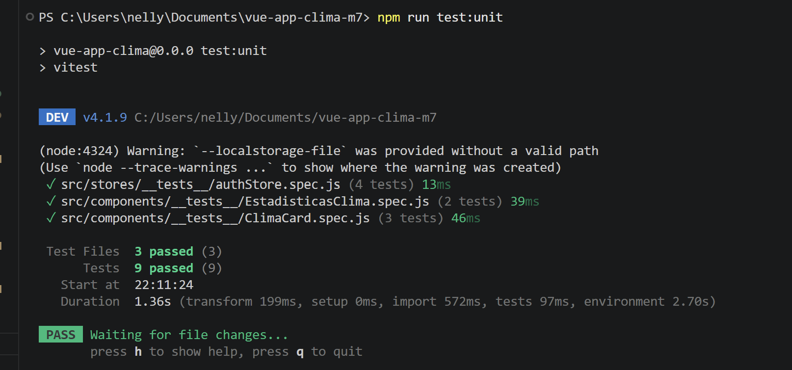

# Módulo 7 - App del Clima con Login, Usuarios y Estado Global

## Descripción del proyecto

Este proyecto corresponde a una App del Clima desarrollada con Vue 3, Vite, Vue Router y Pinia.

La aplicación fue construida sobre la base del proyecto del Módulo 6, donde se consultaba información real del clima usando la API pública de Open-Meteo. En esta nueva versión del Módulo 7 se agregaron funcionalidades de autenticación, registro de usuarios, estado global, rutas protegidas, favoritos y preferencias personalizadas por usuario.

Aunque la pauta menciona Vuex, este proyecto utiliza Pinia como alternativa moderna recomendada para Vue 3. Pinia cumple la función de manejar el estado global de la aplicación, permitiendo guardar el usuario autenticado, sus favoritos y sus preferencias.

## Objetivo del ejercicio

Agregar a la App del Clima un sistema básico de usuarios que permita:

- Iniciar sesión.
- Registrar un nuevo usuario.
- Mantener el estado de autenticación.
- Proteger rutas privadas.
- Personalizar la experiencia según el usuario conectado.
- Guardar ciudades favoritas.
- Cambiar preferencias de temperatura y tema visual.


## Funcionalidades principales

### Funcionalidades del clima

- Listado de comunas de Chiloé.
- Consulta de clima actual usando Open-Meteo.
- Visualización de temperatura, humedad, viento y estado del clima.
- Búsqueda de ciudades mediante v-model.
- Cambio de unidad entre Celsius y Fahrenheit.
- Vista de detalle por ciudad.
- Pronóstico semanal.
- Estadísticas de temperatura mínima, máxima y promedio.
- Navegación interna con Vue Router.


### Funcionalidades de usuarios

- Inicio de sesión con usuarios simulados.
- Registro básico de nuevos usuarios.
- Validación de credenciales.
- Mensaje de error cuando el usuario o contraseña son incorrectos.
- Visualización del usuario conectado.
- Cierre de sesión.
- Persistencia de sesión mediante LocalStorage.


### Funcionalidades de personalización

- Ciudades favoritas por usuario.
- Vista protegida de favoritos.
- Vista protegida de perfil.
- Preferencias de usuario:
    - Unidad de temperatura: Celsius o Fahrenheit.
    - Tema visual: claro u oscuro.


## Rutas protegidas

Las rutas **/favoritos** y **/perfil** requieren que el usuario haya iniciado sesión.

Si un usuario intenta ingresar a una ruta protegida sin estar autenticado, la aplicación lo redirige automáticamente a **/login**.

## Usuario de prueba

Para probar el inicio de sesión se puede utilizar:

|Campo | Valor |
|---|---|
|Correo | `nelly@test.com`|
|Contraseña| `123456` |


## Rutas de la aplicación

| Ruta | Descripción |
|---|---|
| `/` |	               Página principal con listado de ciudades y clima actual. |
| `/about` |         Información general del proyecto. | 
|`/detalle/:id` |    Detalle del clima de una ciudad. |
|`/login` |	           Inicio de sesión. |
|`/registro` |      Registro de usuario. |
|`/favoritos`|	       Ruta protegida con ciudades favoritas. |
|`/perfil` |	           Ruta protegida con preferencias del usuario. |


## Tecnologías utilizadas

- Vue 3
- Vite
- Composition API
- <script setup>
- Vue Router
- Pinia
- JavaScript
- CSS
- Open-Meteo API
- LocalStorage
- Git
- GitHub


## Estructura principal del proyecto

```bash
vue-app-clima-m7/
├── docs/
│   └── test-unitarios.png
├── src/
│   ├── api/
│   │   └── usuariosApi.js
│   ├── assets/
│   │   ├── img/
│   │   └── main.css
│   ├── components/
│   │   ├── __tests__/
│   │   │   ├── ClimaCard.spec.js
│   │   │   └── EstadisticasClima.spec.js
│   │   ├── ClimaCard.vue
│   │   └── EstadisticasClima.vue
│   ├── data/
│   │   ├── ciudades.js
│   │   └── usuariosMock.js
│   ├── router/
│   │   └── index.js
│   ├── services/
│   │   └── ClimaServices.js
│   ├── stores/
│   │   ├── __tests__/
│   │   │   └── authStore.spec.js
│   │   └── authStore.js
│   ├── views/
│   │   ├── AboutView.vue
│   │   ├── DetalleView.vue
│   │   ├── FavoritosView.vue
│   │   ├── HomeView.vue
│   │   ├── LoginView.vue
│   │   ├── PerfilView.vue
│   │   └── RegistroView.vue
│   ├── App.vue
│   └── main.js
├── package.json
├── vite.config.js
└── README.md
```

## Estado global con Pinia

El estado global se maneja en authStore.js.

Este store permite administrar:

- Usuario autenticado.
- Estado de carga.
- Mensajes de error.
- Login.
- Registro.
- Logout.
- Favoritos.
- Preferencias de temperatura.
- Preferencias de tema visual.

Pinia permite compartir estos datos entre distintas vistas sin repetir lógica en cada componente.


## Pruebas unitarias

Se implementaron pruebas unitarias utilizando Vitest y Vue Test Utils para verificar el correcto funcionamiento de componentes reutilizables y del estado global de la aplicación.

Resultado Obtenido:



Las pruebas realizadas validan:

- Renderizado correcto del componente `ClimaCard.vue`.
- Conversión de temperatura entre Celsius y Fahrenheit.
- Enlace de navegación hacia el detalle de una ciudad.
- Cálculo de temperatura mínima, máxima y promedio en `EstadisticasClima.vue`.
- Funcionamiento del `authStore.js` para agregar, evitar duplicados y eliminar favoritos.

Archivos testeados:

- `ClimaCard.vue`
- `EstadisticasClima.vue`
- `authStore.js`


Para ejecutar las pruebas unitarias:

```sh
npm run test:unit
```

## Protección de rutas

La protección de rutas se implementó mediante un guard de Vue Router.

Las rutas privadas utilizan:
```sh
meta: { requiresAuth: true }
```
El **guard** revisa si el usuario está autenticado. Si no lo está, se redirige a la vista de login.


## Instalación del proyecto

### Clonar el repositorio:

Para descargar el proyecto en tu computador, ejecuta el siguiente comando:
```sh
git clone https://github.com/ferradasmane-droid/vue-app-clima-m7.git
```

Entrar a la carpeta del proyecto:

**cd vue-app-clima-m7**

Instalar dependencias:
```sh
npm install
```

## Ejecutar en modo desarrollo
```sh
npm run dev
```

Luego abrir en el navegador la URL indicada por Vite, por ejemplo:

http://localhost:5173/


## Crear versión de producción
```sh
npm run build
```

## Repositorio

[Ver epositorio público en GitHub](https://github.com/ferradasmane-droid/vue-app-clima-m7)


## Autora

Nelly Ferrada

